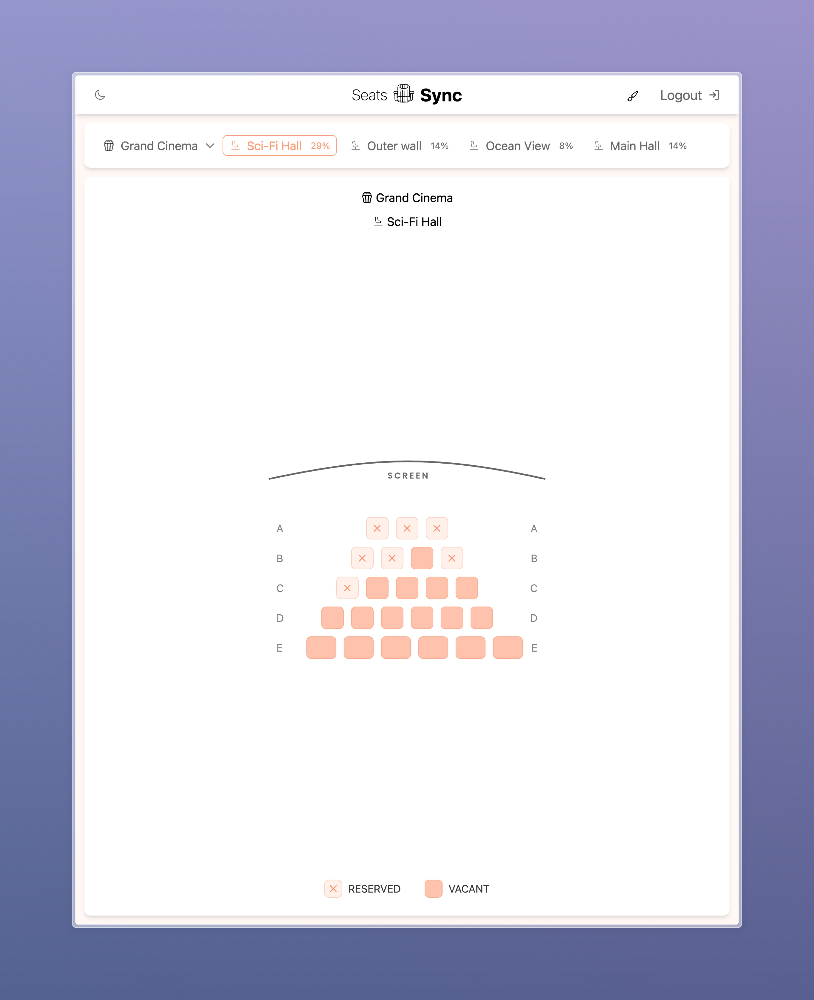
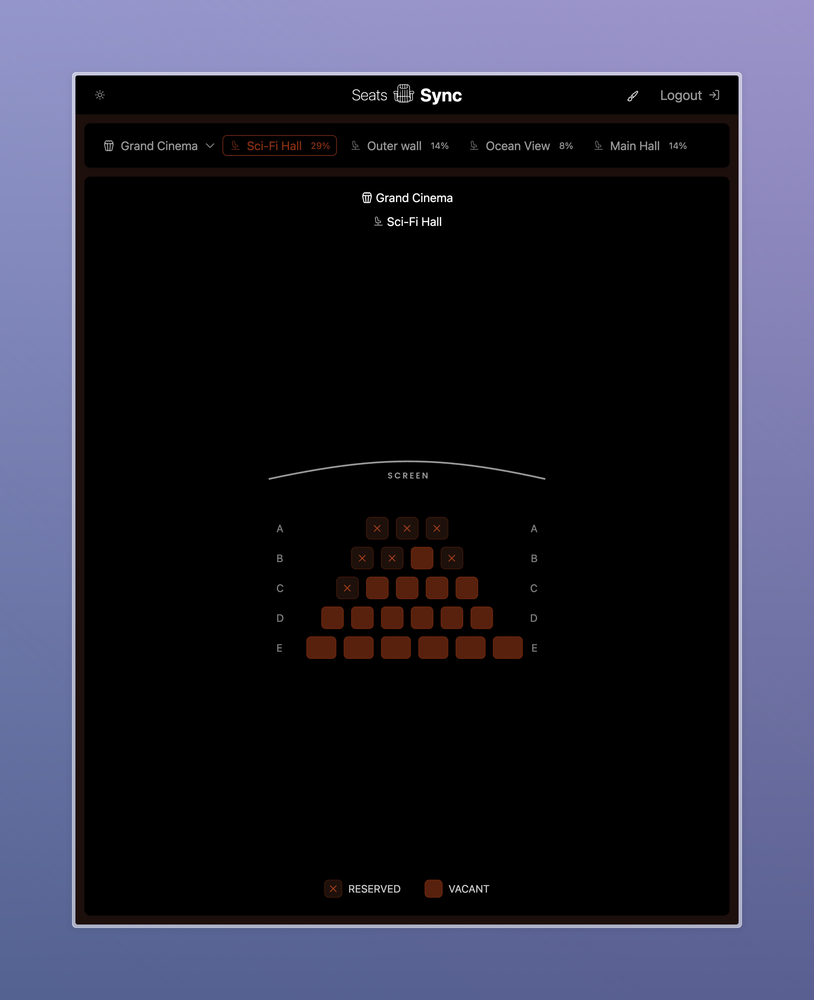
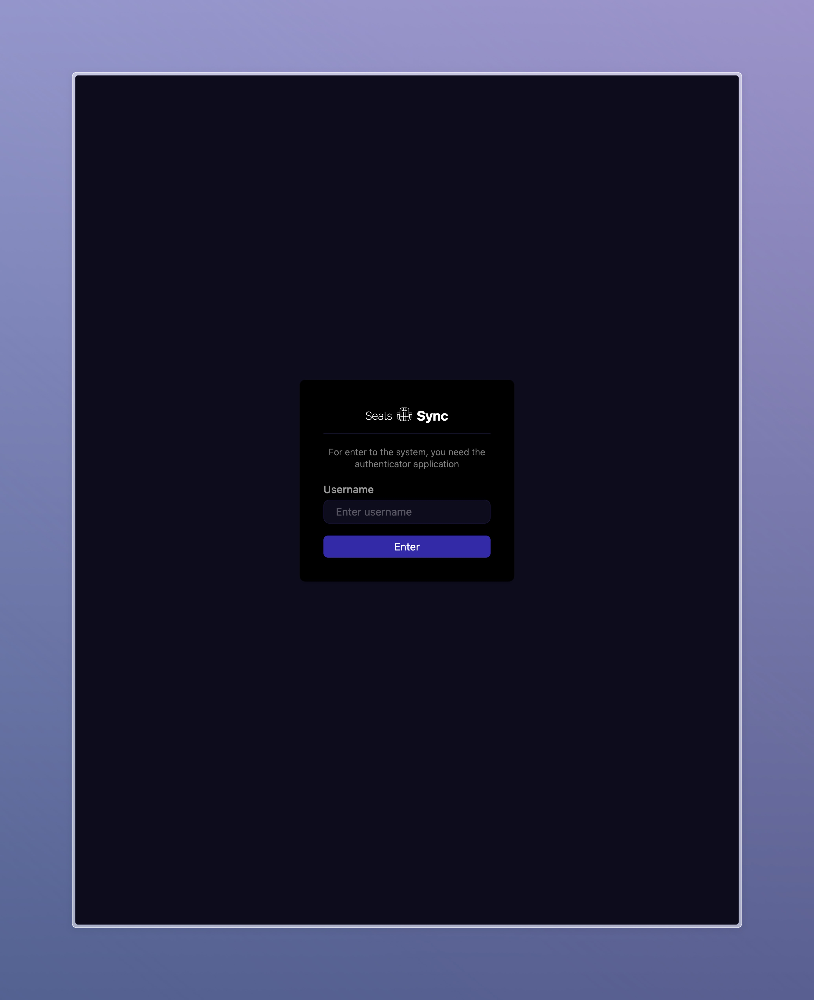
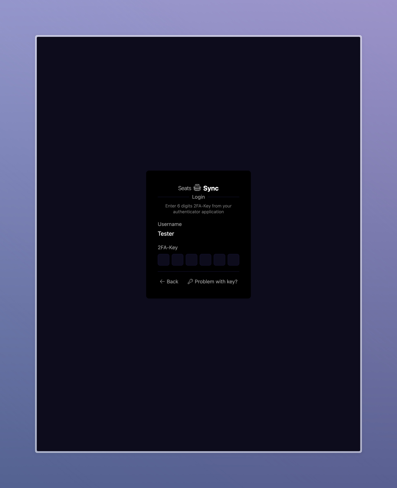
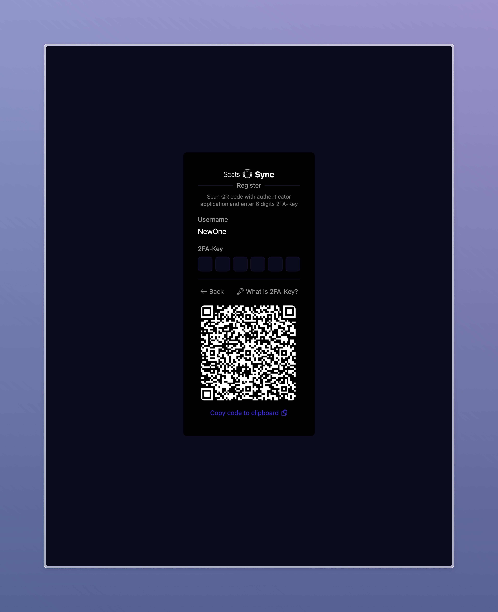

# SeatsSync

<div align="center">
  <h3>🎭 Seat Reservation System</h3>
  
  
  
  
  
  
  
  
  
  
  
  
</div>

## About

SeatsSync is a full-stack application for managing seat reservations, built as a monorepo with a shared component architecture. The system features real-time updates through WebSockets, elegant state management, and fancy UI.

## 🎥 Interface Demo

### Live Demo
https://github.com/user-attachments/assets/21112cb3-cdd6-458d-bade-78a67cccf966

### Main Interface
<div align="center">
  
  
</div>

### Theme Switching
https://github.com/user-attachments/assets/eba6921e-e427-4c22-85dc-b97d0e3a104a

### Authentication Flow
<div align="center">
  
  
  
</div>

## 🌟 Key Features

- **Real-time Communication**: WebSocket-based architecture with ping-pong heartbeat mechanism and auto-reconnect
- **Modern Auth System**: Two-factor authentication (2FA) with QR code integration
- **State Management**: Combination of RxJS for complex workflows and XState for state machines
- **Custom UI System**: Modular component architecture with dynamic theming
- **Monorepo Structure**: Shared types, utilities, and configurations across applications

## 🏗️ Project Structure

This project uses a monorepo architecture to share code between frontend and backend:

```
SeatsSync/
├── apps/                 # Application code
│   ├── frontend/         # Vue.js frontend application
│   └── backend/          # Node.js backend application
│
└── packages/             # Shared packages
    ├── config/           # Shared configurations (ESLint, Prettier, TypeScript)
    ├── constants/        # Common constants and enumerations
    ├── logger/           # Shared logging utilities
    ├── types/            # TypeScript type definitions
    └── utils/            # Shared utility functions
```

## 🔧 Technical Stack

### Frontend [](./apps/frontend/README.md)

- **Framework**: Vue 3 with Composition API
- **Build Tool**: Vite with custom plugins
- **State Management**: 
  - RxJS for reactive state handling
  - Pinia for application state
  - XState for complex state machines
- **UI**: TailwindCSS with custom utility-first approach
- **Custom Utilities**:
  - ModalLite for modals management
  - ToastsLite for notifications
  - Dynamic theme generation from a single color

#### Frontend Architecture Overview
```
src/
├── api/          # API communication layer with WebSocket client
├── assets/       # Static assets including icons and styles
├── composables/  # Vue composables for reusable logic
├── constants/    # Application constants
├── directives/   # Vue custom directives
├── lib/          # Custom libraries (ToastsLite, ModalLite)
├── plugins/      # Vite plugins (SVG sprite compiler)
├── router/       # Routing configuration with middlewares
├── stores/       # Pinia stores for state management
├── types/        # TypeScript type definitions
├── ui/           # UI components organized by functionality
│   ├── base/     # Base UI components
│   ├── common/   # Common components
│   ├── pages/    # Page components
│   ├── popovers/ # Popover components
│   └── sections/ # Page section components
└── utils/        # Utility functions
```
#### WebSocket Communication
- Real-time communication with the backend using WebSocket protocol
- Robust ping-pong heartbeat mechanism to maintain connection health
- Automatic reconnection strategy with exponential backoff
- Queuing of messages during disconnection periods

#### State Management
- Reactive state management using RxJS for complex async workflows
- Pinia stores for application state

#### Authentication System
- Two-factor authentication (2FA) using authenticator applications
- XState-powered authentication flow for managing complex state transitions
- QR code generation for authenticator app setup
- Secure login and registration flows

#### UI Components
- Modular UI architecture with reusable components
- Responsive design that works across devices
- Custom form controls with comprehensive validation

#### ModalLite
- Lightweight modal management system
- Focus trapping for accessibility
- Stacking support for nested modals
- Teleporting strategy for proper DOM placement

#### ToastsLite
- Simple yet powerful toast notification system
- Support for different types (success, error, info, etc.)
- Promise-based notifications for async operations
- Customizable positioning and durations

#### Color Theme System
- Innovative approach to generating a complete color palette from a single base color
- Automatic light/dark mode detection with user preference override
- Smooth transitions between theme changes
- Cross-tab theme synchronization using BroadcastChannel API

#### Routing System
- Vue Router with middleware support
- Role-based access control for routes
- Navigation guards for authentication checks
- Middleware aggregator for clean composition of route guards

#### Developer Experience
- Custom Vite plugin for SVG sprite generation with automatic type generation
- Hot module replacement for rapid development
- TypeScript for improved code quality and developer experience
- ESLint and Prettier for code quality and consistency


### Backend [](./apps/backend/README.md)

- **Server**: Node.js with Express
- **WebSockets**: Custom WebSocket implementation with heartbeat
- **Architecture**: Layered architecture with clear separation of concerns
- **Data Storage**: In-memory with persistence capability
- **Security**: JWT-based authentication with 2FA

#### Backend Architecture Overview

The system is built with high modularity and loose coupling in mind:

```
src/
├── controllers/      # Entry points (WebSocket, HTTP)
├── methods/         # Business operations
├── subscriptions/   # Real-time update handlers
├── models/         # Data and business rules
├── core/           # Infrastructure services
└── shared/         # Common utilities
```

#### Layer Dependencies

```
┌─────────────────┐
│   Controllers   │ → Entry points only
├─────────────────┤
│    Methods      │ → Business logic
│  Subscriptions  │ → Real-time updates
├─────────────────┤
│     Models      │ → Data & rules
├─────────────────┤
│      Core       │ → Infrastructure
├─────────────────┤
│     Shared      │ → Utilities
└─────────────────┘
```

#### Key Architectural Principles

1. **Unidirectional Dependencies**
   - Each layer depends only on layers below it
   - No circular dependencies allowed
   - Clear and predictable data flow

2. **Loose Coupling**
   - Layers communicate through well-defined interfaces
   - Implementation details are hidden
   - Easy to replace or modify components

3. **High Cohesion**
   - Each module has a single, well-defined responsibility
   - Related functionality is grouped together
   - Clear separation of concerns

4. **Scalability**
   - Independent scaling of components
   - Easy to add new features
   - Simple to extend existing functionality


#### WebSocket Communication

The backend implements a single WebSocket connection per client with several reliability features:

- **Heartbeat Mechanism**: Ping-pong protocol to detect connection health
  - Server sends ping every 30 seconds
  - Client must respond with pong within 5 seconds
  - Connection is considered dead if no pong received

- **Message Protocol**:
  ```typescript
  // Request (Client -> Server)
  {
    type: string;      // Method name
    data: any;         // Method parameters
    eid: string;       // External ID for tracking
    ts: number;        // Timestamp
  }

  // Response (Server -> Client)
  {
    type: string;      // Original method name
    data: any;         // Response data
    eid: string;       // Same external ID
    ts: number;        // Timestamp
    error?: string;    // Optional error code
  }
  ```

#### PubSub System

The backend uses a robust PubSub pattern for real-time updates:

- **Decoupled Communication**: Publishers and subscribers are completely isolated
- **Topic-based Messaging**: Updates are organized by topics (e.g., 'seat.subscribe', 'cinemas.subscribe')
- **Selective Broadcasting**: Messages are delivered only to relevant subscribers
- **Subscription Management**:
  - Automatic cleanup on client disconnect
  - Support for temporary and permanent subscriptions
  - Rate limiting and backpressure handling

#### Layer Responsibilities

#### 1. Controllers

- Request handling
- Coordination between methods and subscriptions
- Dependencies: methods, subscriptions

#### 2. Methods & Subscriptions

- Methods: Business logic operations
- Subscriptions: Real-time update handling
- Dependencies: models
- Note: Methods and Subscriptions interact only through controllers

### 3. Models

- Data access
- Business rules implementation
- Dependencies: core

### 4. Core

- Infrastructure services (Database, WebSocket, PubSub)
- Dependencies: shared

### 5. Shared

- Types
- Constants
- Utility functions
- Dependencies: none

#### Data Flow Example

Example of `get_cinemas` request flow:

```typescript
// 1. Request arrives at entrypoint
WebSocket
  // 2. Routes to controller
  → CinemaController
    // 3. Controller calls method
    → getCinemas method
      // 4. Method works with model
      → CinemaModel
        // 5. Model uses core for data access
        → Database (core)
```

### Authentication Flows

#### Connection Authentication

0. FE open the socket connection.
1. While opening the connections, BE checks the http-only token in the cookie.
2. If token is active, user is logged in.
3. If token is expired or not exists, user is not logged in.

#### Login Flow

0. FE start to auth.
1. FE send request with username to BE.
2. BE checks username, and returns status:user and waiting for the 6-digit code.
3. FE enters 6 digits code from authenticator app and sends it to BE.
4. BE checks code and if it is correct, user is authorized.
5. BE returns a token to FE.
6. FE should recreate the socket connection.

#### Registration Flow

0. FE start to auth.
1. FE send request with username to BE.
2. BE checks username, and returns status:candidate with qr_code and waiting for the 6-digit code.
3. FE scans the qr_code and enters 6 digits code from authenticator app, then sends the code to BE.
4. BE checks code and if it is correct, user is authorized.
5. BE returns a token to FE.
6. FE should recreate the socket connection.

## 🚀 Getting Started

1. Install dependencies:
```bash
bun install
```

2. Start development:
```bash
bun dev
```

## ⚙️ Available Scripts

- `bun dev` - Start development environment
- `bun build` - Build all projects
- `bun lint` - Run linting
- `bun format` - Format code

