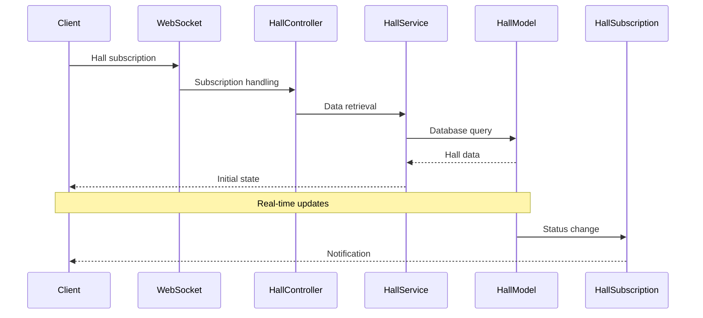

# Backend Architecture

The backend follows a layered architecture with strict dependency rules where each layer can only import from layers below it. This ensures a predictable data flow and maintainable codebase.

## Architecture Overview

```
src/
├── controllers/      # Application entry points (WebSocket, HTTP)
├── methods/          # Business logic operations
├── subscriptions/    # Real-time updates handling
├── models/           # Data access and business rules
├── core/             # Infrastructure (DB, WebSocket, PubSub)
└── shared/           # Shared utilities, types, and constants
```

### Layer Dependencies

```
┌─────────────────┐
│   CONTROLLERS   │ → WebSocket and HTTP entry points
├─────────────────┤
│    METHODS      │ → Business operations
│  SUBSCRIPTIONS  │ → Real-time updates
├─────────────────┤
│     MODELS      │ → Data access and business rules
├─────────────────┤
│      CORE       │ → Infrastructure services
├─────────────────┤
│     SHARED      │ → Common utilities and types
└─────────────────┘
```

## Authentication Flows

### Connection Authentication

0. FE open the socket connection.
1. While opening the connections, BE checks the http-only token in the cookie.
2. If token is active, user is logged in.
3. If token is expired or not exists, user is not logged in.

### Login Flow

0. FE start to auth.
1. FE send request with username to BE.
2. BE checks username, and returns status:user and waiting for the 6-digit code.
3. FE enters 6 digits code from authenticator app and sends it to BE.
4. BE checks code and if it is correct, user is authorized.
5. BE returns a token to FE.
6. FE should recreate the socket connection.

### Registration Flow

0. FE start to auth.
1. FE send request with username to BE.
2. BE checks username, and returns status:candidate with qr_code and waiting for the 6-digit code.
3. FE scans the qr_code and enters 6 digits code from authenticator app, then sends the code to BE.
4. BE checks code and if it is correct, user is authorized.
5. BE returns a token to FE.
6. FE should recreate the socket connection.

## WebSocket Communication

The protocol is message-based:

```typescript
// Client -> Server (Request)
{
  type: "name",             // Method to call
  data: { ... },            // Method parameters
  eid: "uuid",              // External user id
  ts: 1234567890            // Timestamp
}

// Server -> Client (Response)
{
  type: "name",                // Original method
  data: { ... },               // Response data
  eid: "uuid",                 // Same ID
  ts: 1234567890,              // Timestamp
  error?:  "ERROR_CODE",       // Error code
}
```

### Seat Status Update Flow



## Layer Responsibilities

### 1. Entrypoints

- Application initialization
- Request routing
- Dependencies: controllers

### 2. Controllers

- Request handling
- Coordination between methods and subscriptions
- Dependencies: methods, subscriptions

### 3. Methods & Subscriptions

- Methods: Business logic operations
- Subscriptions: Real-time update handling
- Dependencies: models
- Note: Methods and Subscriptions interact only through controllers

### 4. Models

- Data access
- Business rules implementation
- Dependencies: core

### 5. Core

- Infrastructure services (Database, WebSocket, PubSub)
- Dependencies: shared

### 6. Shared

- Types
- Constants
- Utility functions
- Dependencies: none

## Code Examples

### Data Flow Example

Example of `get_cinemas` request flow:

```typescript
// 1. Request arrives at entrypoint
WebSocket
  // 2. Routes to controller
  → CinemaController
    // 3. Controller calls method
    → getCinemas method
      // 4. Method works with model
      → CinemaModel
        // 5. Model uses core for data access
        → Database (core)
```

## Benefits

1. **Predictable Data Flow**

   - Data always flows from top to bottom
   - Clear dependency hierarchy

2. **Isolated Layers**

   - Each layer has clear responsibility
   - Easy to test each layer independently

3. **Easy to Extend**

   - Clear place for new functionality
   - Simple to add new methods and subscriptions

4. **Improved Maintainability**
   - No circular dependencies
   - Clear project structure

## Development

### Prerequisites

- Node.js 18+
- PostgreSQL
- Bun

### Environment Setup

1. Copy `.env.example` to `.env`
2. Configure database connection in `.env`
3. Configure the following variables:
   - `DATABASE_URL` - PostgreSQL connection string
   - `JWT_SECRET` - Secret for JWT tokens
   - `PORT` - Server port (default: 3000)
   - `WS_PORT` - WebSocket port (default: 3001)

### Available Scripts

- `bun dev` - Start development server
- `bun build` - Build for production
- `bun lint` - Run linting
- `bun format` - Format code
- `bun test` - Run tests

### Database

The project uses Prisma as ORM. To work with database:

- `bun prisma generate` - Generate Prisma Client
- `bun prisma migrate dev` - Run migrations
- `bun prisma studio` - Open Prisma Studio
