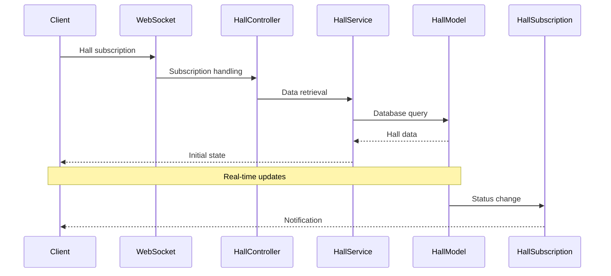

# Seats Sync Backend

Real-time hall occupancy monitoring system backend service.

## 🏗 Architecture

### Module Structure

```
src/
├── core/           # Application core
├── modules/        # Business modules
├── utils/         # Shared utilities
├── constants/      # Constants
└── index.ts        # Entry point
```

### Database Entities

#### Cinema

- Main entity representing a cinema
- Contains basic information: name and color scheme
- Has one-to-many relationship with halls

#### Hall

- Represents a cinema hall
- Contains size information (rows and seats)
- Connected to cinema and contains seats

#### Seat

- Detailed information about each seat in the hall
- Includes coordinates and dimensions for display
- Has status (vacant/occupied/maintenance)
- Linked to seat type

#### SeatType

- Defines the type of seat (standard, VIP, etc.)
- Used for seat categorization

#### User

- System user information
- Two-factor authentication support
- Token and recovery management

### Business Modules

Each module is organized according to Domain-Driven Design (DDD) principles and contains:

```
modules/
├── cinema/                 # Cinema module
│   ├── cinema.types.ts    # Types and interfaces
│   ├── cinema.model.ts    # Database operations
│   ├── cinema.service.ts  # Business logic
│   ├── cinema.methods.ts  # API methods
│   ├── cinema.controller.ts # Request handling
│   ├── cinema.subscription.ts # WebSocket subscriptions
│   └── index.ts          # Public API
├── hall/                  # Hall module
└── user/                  # User module
```

## 🔧 Tech Stack

- **Runtime**: Node.js with TypeScript
- **Language**: TypeScript 5.6
- **Database**: PostgreSQL with Prisma ORM
- **API Framework**: Express.js
- **WebSocket**: ws library with custom implementation
- **Authentication**: Two-factor auth with speakeasy
- **Logging**: Winston
- **Containerization**: Docker

### Core Dependencies

- **@prisma/client**: ^5.22.0 - Database ORM
- **express**: ^4.21.1 - Web framework
- **ws**: ^8.18.0 - WebSocket server
- **jsonwebtoken**: ^9.0.2 - JWT authentication
- **speakeasy**: ^2.0.0 - Two-factor authentication
- **winston**: ^3.17.0 - Logging
- **node-cache**: ^5.1.2 - In-memory caching

### Development Tools

- **nodemon**: Hot reloading for development
- **tsx**: TypeScript execution
- **typescript**: ^5.6.3
- **prettier**: Code formatting

## 📐 Architectural Decisions

### 1. Modular Architecture

- Each module is independent and self-contained
- Clear separation of responsibilities within modules
- Business logic encapsulation

### 2. Data Operations

- **Model**: Direct database interaction
- **Service**: Business logic and validation
- **Controller**: HTTP/WebSocket request handling
- **Types**: Strong typing

### 3. Real-time Communication

- WebSocket for real-time updates
- Publisher/Subscriber pattern for notifications
- Multiple connection support

### 4. Error Handling

- Centralized error handling
- Typed errors for different cases
- Error logging with context

## 🔄 Data Flows

### Authentication

> FE - Frontend | BE - Backend

0. FE open the socket connection.
1. While opening the connections, BE checks the http-only token in the cookie.
2. If token is active, user is logged in.
3. If token is expired or not exists, user is not logged in.

---

### Login

0. FE start to auth.
1. FE send request with username to BE.
2. BE checks username, and returns status:user and waiting for the 6-digit code.
3. FE enters 6 digits code from authenticator app and sends it to BE.
4. BE checks code and if it is correct, user is authorized.
5. BE returns a token to FE.
6. FE should recreate the socket connection.

---

### Register

0. FE start to auth.
1. FE send request with username to BE.
2. BE checks username, and returns status:candidate with qr_code and waiting for the 6-digit code.
3. FE scans the qr_code and enters 6 digits code from authenticator app, then sends the code to BE.
4. BE checks code and if it is correct, user is authorized.
5. BE returns a token to FE.
6. FE should recreate the socket connection.

---

### WebSocket Communication

The protocol is message-based:

```typescript
// Client -> Server (Request)
{
  type: "name",             // Method to call
  data: { ... },            // Method parameters
  eid: "uuid",              // External user id
  ts: 1234567890            // Timestamp
}

// Server -> Client (Response)
{
  type: "name",                // Original method
  data: { ... },               // Response data
  eid: "uuid",                 // Same ID
  ts: 1234567890,              // Timestamp
  error?:  "ERROR_CODE",       // Error code
}


### Seat Status Update


## 🛠 Development & Deployment

### Available Scripts

```bash
# Install dependencies
npm install

# Run in development mode with hot reload
npm run dev

# Build the project
npm run build

# Run in production mode
npm run start
```

### Docker Deployment

```bash
# Build and run with Docker Compose
make up

# Stop containers
make down

# View logs
make logs
```

### Environment Setup

1. Copy `.env.example` to `.env`
2. Configure the following variables:
   - `DATABASE_URL` - PostgreSQL connection string
   - `JWT_SECRET` - Secret for JWT tokens
   - `PORT` - Server port (default: 3000)
   - `WS_PORT` - WebSocket port (default: 3001)
